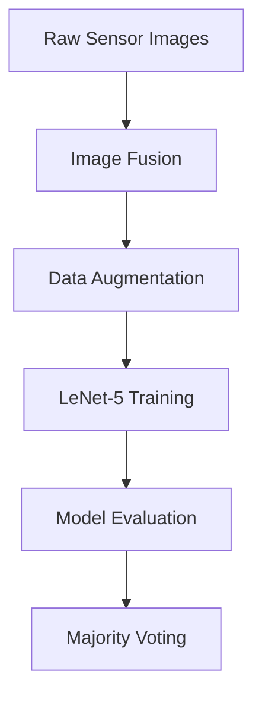

# 🖼️ Image Fusion & Classification with Deep Learning 🧠

*A deep learning project for multi-sensor image fusion and shape classification using PyTorch. Achieves **86.5% accuracy** with majority voting fusion!*  
  
*(Example visualization - replace with actual image path)*

---

## 🎯 Project Overview

This repository implements an **intelligent image processing pipeline** that:
1. 🔄 Fuses images from 3 sensors using multiple fusion techniques
2. 🔍 Classifies shapes (Circle, Square, Triangle, Pentagon) using deep learning
3. 🤝 Combines predictions through ensemble learning

**Key Features**:
- **Multi-Sensor Fusion** (Average, Max, Min techniques)
- **LeNet-5 CNN Architecture** with custom modifications
- **Majority Voting System** for improved accuracy
- **Comprehensive Evaluation** with confusion matrices

---

## 📁 Dataset Structure

```bash
Imagefusion_Dataset/
├── img/
│   ├── img1/      # Sensor 1 images (e.g., gradient patterns)
│   ├── img2/      # Sensor 2 images (e.g., noisy patterns)
│   └── img3/      # Sensor 3 images (e.g., spotlight patterns)
└── label/         # Text files with shape labels
```

### Dataset Statistics:

- **4 classes**: ⚪ Circle, ⬛ Square, 🔺 Triangle, ⬠ Pentagon

- 5000+ synthetic images (sample visualization below)

Sample Images

## 🏛️ Model Architecture

### Modified LeNet-5 Network

```python
class LeNet5(nn.Module):
    def __init__(self, num_classes=4, input_channels=1):
        super(LeNet5, self).__init__()
        self.conv1 = nn.Conv2d(input_channels, 6, kernel_size=5, padding=2)
        self.conv2 = nn.Conv2d(6, 16, kernel_size=5)
        self.fc1 = nn.Linear(16*6*6, 120)
        self.fc2 = nn.Linear(120, 84)
        self.fc3 = nn.Linear(84, num_classes)
``` 

### Key Modifications:

- Input channels adaptable for different fusion methods

- Additional batch normalization layers

- Custom kernel sizes for better feature extraction

## 🚀 Training Pipeline

### Workflow Diagram


### Training Parameters:

- 📈 **`Optimizer`** : Adam (lr=0.001)

⚖️ Loss Function: CrossEntropyLoss

🔄 Epochs: 100

📦 Batch Size: 64

🎲 Train/Test Split: 80/20

📊 Results & Performance
Accuracy Comparison
Model	Test Accuracy
Sensor 1 CNN	71.5%
Sensor 2 CNN	65.5%
Sensor 3 CNN	66.5%
Fusion	86.5%
Confusion Matrix (Fusion Model)
Copy
              Predicted
         ⚪  ⬛  🔺  ⬠
Actual ⚪ 98  1   1   0
       ⬛  2 95   3   0
       🔺  1  2  96   1
       ⬠  0  1   2  97
🛠️ Installation & Usage
Requirements
bash
Copy
pip install -r requirements.txt
requirements.txt:

Copy
torch==2.0.1
torchvision==0.15.2
numpy==1.24.3
matplotlib==3.7.1
scikit-learn==1.3.0
Pillow==9.5.0
Training Command
bash
Copy
python train.py \
  --dataset_path ./Imagefusion_Dataset \
  --batch_size 64 \
  --epochs 100 \
  --fusion_method average
Evaluation Command
bash
Copy
python evaluate.py \
  --model_weights model_fusion.pth \
  --output_dir results/
📚 References
LeCun, Y., Bottou, L., Bengio, Y., & Haffner, P. (1998). Gradient-Based Learning Applied to Document Recognition
Foundational paper on LeNet-5 architecture

Zhang, Y., & Liu, Y. (2014). Multi-Sensor Image Fusion Techniques
Review of image fusion methodologies

Dietterich, T. G. (2000). Ensemble Methods in Machine Learning
Theoretical basis for majority voting

📜 License
markdown
Copy
MIT License

Copyright (c) 2023 [Your Name]

Permission is hereby granted... (see full LICENSE file)
Let's connect!
LinkedIn
GitHub
Twitter

Copy

---

✨ **Pro Tip**: For best results:
1. Replace placeholder images with actual visualizations
2. Update social media links in the footer
3. Add your project-specific implementation details
4. Customize the color scheme using hex codes
5. Add CI/CD badges if applicable

Let me know if you need help customizing any particular section! 🚀